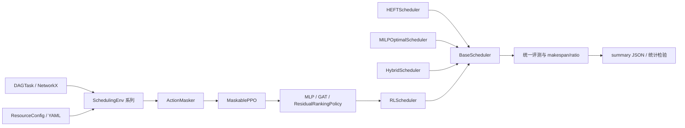

# 基于深度强化学习的云-边-端异构计算资源管理调度方法

## 项目技术报告（Markdown 审阅稿）

> 参赛赛题：第三届中国研究生操作系统开源创新大赛第 16 题
>
> 报告版本：V1.0（审阅稿）
>
> 数据审计日期：2026 年 7 月 16 日
>
> 最终提交方案：Residual Scheduling + Best-of-64 Sampling

---

## 目录

1. 第一章：项目概述
2. 第二章：系统架构设计
3. 第三章：技术路线演进与方法设计
4. 第四章：实验结果与性能评估
5. 第五章：复现实验说明
6. 第六章：局限性与未来工作
7. 参考文献
8. 附录 A：赛题评分项对齐
9. 附录 B：数据差异与溯源说明
10. 附录 C：主要证据文件索引

---

## 摘要

本项目面向云、边、端多层异构计算环境中的有向无环图（Directed Acyclic Graph，DAG）任务调度问题，研究在任务依赖、资源算力差异、跨资源通信开销和资源互斥约束同时存在的条件下，如何通过深度强化学习缩短全部任务的完成时间（makespan）。项目基于 Gymnasium 和 MaskablePPO 构建可配置的调度环境，以 HEFT（Heterogeneous Earliest Finish Time）作为主要启发式基线，并形成了环境仿真、基线算法、强化学习策略、训练、评测、诊断和测试相互解耦的模块化实现。

项目的技术路线不是一次性确定的，而是经过奖励稀疏性、策略塌缩、特征量纲、动作空间复杂度、模仿学习稳定性和推理随机性等多轮可复现实验逐步收敛。最关键的两项结构性改进是：第一，将原先“就绪任务 × 资源”的联合动作空间拆分为“策略负责任务排序、确定性 EFT 规则负责资源分配”的 ranked 动作空间；第二，在 HEFT upward rank 的基础上引入零初始化的残差策略头，使训练初始策略严格等价于 HEFT，策略只学习排序修正量。最终再通过 Best-of-64 随机采样择优，在 20 个固定验证场景上稳定超过 HEFT。

严格按项目现存结果文件统计，最终方案在 15 次配对评测中的 `mean_ratio` 为 **0.951527 ± 0.003777**，平均每轮在 **18.2/20** 个场景中反超 HEFT；与 Hybrid+Best-of-16 的配对差值为 -0.007287 ± 0.003524，配对 t 检验得到 `t=-8.0071`、`p=1.3554×10^-6`。另一次独立保存的 5 次重复实验得到 **0.954570 ± 0.003842** 和平均 **18.0/20** 个反超场景。MILP 精确解实验进一步表明，在 7 个 CBC 已证明全局最优的 10～15 任务场景上，HEFT 平均高于最优解 10.68%，Residual+Best-of-16 仅高于最优解 4.42%。数据来源分别为 `evaluation/results/paired15/paired_comparison_summary.json`、`evaluation/results/repeated_bestof64/repeated_bestof64_summary.json` 和 `evaluation/results/milp_optimal_comparison.json`。

**关键词：** 云边端协同；异构计算；DAG 调度；深度强化学习；HEFT；残差学习；动作掩码；随机采样

---

# 第一章 项目概述

## 1.1 研究背景

云计算节点通常具有较高算力和带宽，但访问链路较长；边缘节点靠近数据源，响应更快但容量有限；终端设备就地处理可以减少数据迁移，却受到算力、带宽和能耗等约束。一个实际应用往往不能被视为单个不可分割任务，而应表示为具有前驱约束的数据处理流程。项目采用 DAG 描述这种工作流：节点表示子任务，边表示执行依赖及待传输数据量。

设 DAG 为 `G=(V,E)`，资源集合为 `R`。任务 `i` 的计算量为 `w_i`，资源 `r` 的算力为 `p_r`，则执行时间为：

\[
T_{i,r}^{exec}=\frac{w_i}{p_r}。
\]

若前驱任务 `i` 与后继任务 `j` 分配到不同资源，边 `(i,j)` 的数据量为 `d_{ij}`，两资源带宽分别为 `b_{r_i}`、`b_{r_j}`，则项目中的通信时间为：

\[
T_{ij}^{comm}=\frac{d_{ij}}{\min(b_{r_i},b_{r_j})}；
\]

若两个任务位于同一资源，则通信时间为 0。上述公式由 `env/resource_config.py` 中 `ResourceConfig.get_execution_time()` 和 `ResourceConfig.get_communication_time()` 实现。

调度必须同时满足：每个任务只能选择一个资源；任务开始时间不得早于全部前驱完成及通信结束时间；同一资源上的任务不可重叠。目标是最小化：

\[
C_{max}=\max_{i\in V}F_i，
\]

其中 `F_i` 为任务 `i` 的完成时间。该问题同时包含离散资源分配、任务排序和连续时间安排，属于典型的组合优化问题。

## 1.2 评价指标

项目以 HEFT 作为统一基线。对验证场景 `k`，定义：

\[
ratio_k=\frac{C_{max,k}^{RL}}{C_{max,k}^{HEFT}}，
\qquad
mean\_ratio=\frac{1}{K}\sum_{k=1}^{K}ratio_k。
\]

因此：

- `mean_ratio < 1` 表示强化学习方案整体优于 HEFT；
- `mean_ratio = 1` 表示整体相当；
- `mean_ratio > 1` 表示整体劣于 HEFT。

评测同时报告单场景 `ratio<1` 的数量，以避免均值掩盖不同场景间的差异。常规验证集包含 20 个训练外固定场景，任务规模 10、15、20、25 各 5 个，种子从 1000000 开始。配置见 `training/configs/ppo_mlp_residual.yaml`，场景生成逻辑见 `evaluation/generate_validation_scenarios.py`。

## 1.3 核心成果总览

项目最终形成 **Residual Scheduling + Best-of-64 Sampling** 方案：

1. 环境采用 `SchedulingEnvResidual`，策略动作只决定当前就绪任务的优先次序；
2. 资源分配由遍历全部资源的 EFT 插入规则确定；
3. 策略 logits 为归一化 HEFT upward rank 与有界残差修正量之和；
4. 残差输出层权重和偏置零初始化，训练起点严格复现 HEFT；
5. 推理时独立随机采样 64 个候选调度，并与确定性候选比较，返回 makespan 最小者。

最终统计结果如下：

| 统计口径 | 重复次数 | mean_ratio（均值 ± 样本标准差） | 平均反超 HEFT 场景数 | 数据来源 |
|---|---:|---:|---:|---|
| 最终配对实验中的 Residual Best-of-64 | 15 | **0.951527 ± 0.003777** | **18.2/20** | `evaluation/results/paired15/paired_comparison_summary.json` |
| 独立 Best-of-64 稳定性实验 | 5 | **0.954570 ± 0.003842** | **18.0/20** | `evaluation/results/repeated_bestof64/repeated_bestof64_summary.json` |
| 固定采样种子 20260709 的单次复现 | 1 | **0.945988** | **18/20** | `evaluation/results/summary_mlp_residual_bestof64.json` |

项目已在 Windows 和 openEuler 24.03 LTS-SP4 容器中使用相同模型、场景和采样种子复现 `mean_ratio=0.945988472421`，最新 openEuler 测试结果为 19 项全部通过。证据见 `evaluation/results/openeuler_validation/evaluate_bestof64_output.log`、`evaluation/results/run_final_pipeline_openEuler_existing_checkpoint.log` 和 `evaluation/results/openEuler_pytest_structural_final.log`。

---

# 第二章 系统架构设计

## 2.1 总体架构

项目按“问题定义—算法实现—训练—评测—验证”分层，目录职责如下。

| 模块 | 主要职责 | 关键文件 |
|---|---|---|
| `env/` | DAG、资源模型、Gym 环境、调度物理规则、观测归一化 | `dag_generator.py`、`resource_config.py`、`scheduling_env*.py`、`scheduling_utils.py` |
| `baselines/` | HEFT、MILP、Hybrid 基线 | `heft_scheduler.py`、`milp_optimal_scheduler.py`、`hybrid_scheduler.py` |
| `policies/` | GAT 特征提取、Residual 策略、统一 RL 调度器 | `gat_features_extractor.py`、`residual_ranking_policy.py`、`rl_scheduler.py` |
| `training/` | PPO、BC、课程学习、数据集生成和 YAML 配置 | `train_ppo.py`、`behavior_cloning.py`、`dag_curriculum.py`、`configs/` |
| `evaluation/` | 固定场景生成、常规/Best-of-N/集成/MILP/泛化评测 | `evaluate.py`、`evaluate_bestofn.py` 等 |
| `diagnostics/` | 数据、梯度、归一化、动作空间、策略分布诊断 | `bc_*_check.py`、`action_space_complexity_check.py` 等 |
| `tests/` | 环境、接口、掩码、GAT、Residual、MILP 和一致性回归测试 | `test_*.py` |
| `scripts/` | Linux/openEuler 与 Windows 一键运行 | `run_final_pipeline.sh`、`run_final_pipeline.ps1` |



## 2.2 DAG 与异构资源建模

`env/dag_generator.py` 定义 `DAGTask` 数据类，内部持有 `networkx.DiGraph`、源任务列表和汇任务列表。`generate_random_dag()` 先随机分层，仅允许低层节点指向高层节点，从构造上避免环；节点的 `computation_cost` 和边的 `data_size` 均在默认 1～10 范围内采样。`get_ready_tasks()` 按拓扑序返回所有前驱均已完成的任务。DAG 可通过 `save_dag_to_json()` 和 `load_dag_from_json()` 固化，保证训练集和验证集的种子隔离。

`env/resource_config.py` 定义 `Resource` 和 `ResourceConfig`。默认资源来自 `configs/resource_default.yaml`：

| 资源 | 层级 | compute_power | bandwidth |
|---|---|---:|---:|
| `cloud_0` | cloud | 100 | 1000 |
| `edge_0` | edge | 30 | 200 |
| `edge_1` | edge | 25 | 150 |
| `device_0` | device | 5 | 20 |

资源参数通过 YAML 注入，评测结构无需随资源池改变而修改。例如结构化泛化实验使用 `configs/resource_structural_homogeneous.yaml` 将四个资源算力设置为 40、35、30、25。

## 2.3 Gymnasium 环境与观测空间

`env/scheduling_env.py` 的 `SchedulingEnv` 继承 `gym.Env`。每个 episode 生成一个 DAG，并维护：已完成任务集合、任务到资源的分配、开始/结束时间、每个资源上的 `ScheduledEvent` 时间线、当前就绪任务和 makespan。

观测是 `spaces.Dict`，字段如下：

| 字段 | 形状 | 含义 |
|---|---|---|
| `task_features` | `[max_tasks, 5或6]` | 有效标志、归一化任务编号、计算量、出度、后继计算量之和、可选 upward rank |
| `task_valid_mask` | `[max_tasks]` | padding 中哪些任务槽位有效 |
| `task_adjacency` | `[max_tasks,max_tasks]` | 带自环的 0/1 邻接矩阵 |
| `ready_task_node_ids` | `[max_ready_tasks]` | 就绪槽位到真实任务编号的映射 |
| `resource_features` | `[num_resources,4]` | 可用时间、层级编码、算力、带宽 |
| `global_features` | `[2]` | 已完成比例、当前 makespan |

`env/observation_normalizer.py` 的 `ObservationNormalizer` 只标准化连续特征，不改动 `task_valid_mask`、`task_adjacency` 和 `ready_task_node_ids` 等掩码/索引字段。统计量保存在 `env/normalization_stats.json`，来自 500 个 DAG、8038 个决策样本。

## 2.4 三种动作空间

### 2.4.1 Joint 动作空间

原始 `SchedulingEnv` 使用：

\[
|A|=max\_ready\_tasks\times num\_resources。
\]

动作解码为 `(task_slot, resource_index)`，一次同时选择任务和资源。该模式保留用于历史对照。

### 2.4.2 Ranked 动作空间

`env/scheduling_env_ranked.py` 的 `SchedulingEnvRanked` 将动作空间简化为 `Discrete(max_ready_tasks)`。策略只选择就绪任务，`_select_earliest_finish_resource()` 遍历所有资源，计算依赖就绪时间、执行时长和可插入的最早完成时间，选择 EFT 最小的资源。

### 2.4.3 Residual 动作空间

`env/scheduling_env_residual.py` 的 `SchedulingEnvResidual` 继承 ranked 环境，额外提供 `ready_task_upward_ranks`。动作仍是就绪任务槽位，不改变调度物理约束；差异仅在策略 logits 的构造方式。

## 2.5 插入式资源时间线

`env/scheduling_utils.py` 定义 `ScheduledEvent(task_id,start_time,finish_time)` 和共享函数 `find_earliest_slot()`。函数按事件开始时间排序，从任务的数据就绪时刻开始，优先检查已调度事件之间的空闲间隙，而不是简单追加到资源末尾。

`SchedulingEnv._schedule_task()`、`SchedulingEnvRanked._select_earliest_finish_resource()` 和 `HEFTScheduler.schedule()` 均调用同一函数。因此，在任务顺序和任务—资源分配均相同的条件下，环境与 HEFT 使用完全一致的执行、通信和插入规则。`tests/test_scheduling_consistency.py::test_env_replay_matches_heft_makespan_for_same_assignment` 以 `1e-9` 容差验证该性质；`tests/test_scheduling_env_ranked.py` 进一步验证按 HEFT 任务顺序重放 ranked 环境时 makespan 完全一致。

## 2.6 统一调度接口与插拔能力

根目录 `scheduler_interface.py` 定义抽象类 `BaseScheduler`：

```python
class BaseScheduler(ABC):
    @abstractmethod
    def schedule(self, dag: DAGTask, resource_config: ResourceConfig) -> ScheduleResult:
        ...

    def compute_makespan(self, schedule_result: ScheduleResult) -> float:
        ...
```

`ScheduleResult` 统一为 `{task_id: (resource_id,start_time,finish_time)}`。直接实现该接口的类包括：

- `baselines/heft_scheduler.py::HEFTScheduler`；
- `baselines/milp_optimal_scheduler.py::MILPOptimalScheduler`；
- `baselines/hybrid_scheduler.py::HybridScheduler`；
- `policies/rl_scheduler.py::RLScheduler`。

BC、GAT 和 Residual 是训练方法或策略实现，并非各自独立的 `BaseScheduler` 子类；它们通过 `RLScheduler` 统一接入评测。`RLScheduler` 根据 `scheduler_mode` 选择 `SchedulingEnv`、`SchedulingEnvRanked` 或 `SchedulingEnvResidual`，加载 MaskablePPO checkpoint 并返回标准 `ScheduleResult`。这种设计既保持接口真实准确，也实现了不同策略的插拔式公平比较。

`HybridScheduler` 在任务数不超过阈值时调用 MILP，仅在 CBC **证明最优**后采用 MILP 结果；否则回退到 Residual 策略。对应回归测试位于 `tests/test_hybrid_scheduler.py`。

## 2.7 合法动作处理

Joint 环境中，`SchedulingEnv.action_masks()` 仅将真实就绪任务对应的全部资源动作置为合法；ranked/residual 环境只将真实就绪槽位置为合法。训练侧 `training/train_ppo.py` 使用 `sb3_contrib.common.wrappers.ActionMasker` 包装环境，推理侧 `RLScheduler._schedule_once()` 在每一步把同一 `action_masks()` 传入 `model.predict()`，从而保证训练和推理一致。

关键验证包括：

- `tests/test_env.py::test_action_mask_consistency`：检查掩码与 ready tasks 一致；
- `tests/test_reward_shaping.py`：按 HEFT 分配重放时验证 relative reward；
- `tests/test_scheduling_consistency.py`：验证相同分配下的 makespan 一致；
- `tests/test_residual_scheduling.py`：验证零初始化与 HEFT 等价起点；
- `tests/test_rl_scheduler_interface.py`：验证统一 RL 调度接口。

---

# 第三章 技术路线演进与方法设计

## 3.1 阶段一：初版 MLP+PPO 基线与策略塌缩

初版采用扁平化观测、MLP、MaskablePPO 和 joint 动作空间。奖励为每步 `-1`，episode 结束时再减去当前 makespan：

\[
r_t=-1，\quad
r_T=-1-C_{max}。
\]

固定步数惩罚与不同规模 DAG 的绝对 makespan 不在同一量纲，且主要性能信号只在 episode 末端出现。`diagnostics/action_distribution_check.py` 的历史输出 `diagnostics_action_distribution_output.log` 显示，10 个诊断 DAG 的 180 个任务全部分配给 `cloud_0`，其余三类资源为 0。该策略等价于“始终选择算力最强资源”，忽略了通信、并行执行和时间线空隙。

初版正式评测 `mean_ratio=1.367762`，20 个场景均未反超 HEFT，来源为 `evaluation/results/summary.json`。这一步说明单纯增加训练步数不能补偿缺乏有效信用分配的问题，后续首先调整奖励尺度。

## 3.2 阶段二：相对 HEFT 奖励

项目在 `SchedulingEnv` 中引入 `reward_mode="relative_heft"`。每个 episode 重置时，用独立的 `ResourceConfig` 副本计算 HEFT 参考 makespan，避免污染 RL 时间线；每步只施加 `-0.01` 的轻微惩罚，终止时增加相对差距：

\[
r_t=-0.01，
\qquad
r_T=-0.01-\left(\frac{C_{max}^{RL}}{C_{max}^{HEFT}}-1\right)。
\]

该设计使奖励与最终 `mean_ratio` 同尺度，并消除不同任务规模的绝对 makespan 差异。`tests/test_reward_shaping.py` 通过重放 HEFT 方案验证终止奖励接近 `-0.01`。

需要指出，现存 `evaluation/results/summary_reward_shaped.json` 的实际值仍为 `1.367762`，`reward_shaped_action_distribution_output.log` 仍记录 `cloud_0=100%`，没有支持开发背景中“1.325、cloud_0=96.1%”的可审计文件。因此，本报告不把该历史口径作为已验证结论。奖励重构解决了目标尺度问题，但从现存实验看并未单独解决策略塌缩。

## 3.3 阶段三：GAT 图编码器探索

`policies/gat_features_extractor.py` 实现 `SimpleGATLayer` 和 `TaskGraphFeaturesExtractor`。GAT 使用任务邻接矩阵聚合邻居信息，通过多头注意力、残差连接和 LayerNorm 得到节点嵌入，再拼接就绪任务嵌入、资源嵌入和全图池化嵌入。

Joint 动作空间下，两组 GAT 结果为：

| 配置 | entropy coefficient | mean_ratio | 数据来源 |
|---|---:|---:|---|
| `ppo_gat_reward_shaped.yaml` | 0.03 | 1.383719 | `evaluation/results/summary_gat_reward_shaped.json` |
| `ppo_gat_reward_shaped_lowent.yaml` | 0.01 | 1.332993 | `evaluation/results/summary_gat_lowent.json` |

结果与 MLP 同处 1.3～1.4 区间。由此推断，当策略同时承担任务选择和资源分配时，编码器表达能力不是首要瓶颈。后续在 ranked 动作空间上，GAT deterministic 为 1.087671，仍未优于 MLP ranked 的 1.081277；其 Best-of-64 为 0.980804，也不及最终 Residual。来源分别为 `evaluation/results/summary_gat_ranked.json` 和 `evaluation/results/summary_gat_ranked_bestof64.json`。

## 3.4 阶段四：观测归一化

`bc_batch_mask_and_normalization_check_output.log` 对 8038 个样本进行了字段审计：任务计算量最大约 9.998，后继计算量之和最大约 82.285，而资源带宽最大为 1000；扁平观测整体标准差约 30.936。如此悬殊的量纲会使网络优化偏向大数值字段。

诊断同时排除了 batch mask 交叉污染：合法动作数分别为 4、20、44 的三个样本，批量和单样本 `log_prob` 差异均为 0。93 样本过拟合实验中，未归一化 best accuracy 仅 27.957%，加入标准化后达到 90.323%。完整 joint BC 数据集以 80 epochs、`lr=0.001` 训练时最高准确率达到 99.104%，来源为 `mlp_bc_normalized_strength_test_80e_lr1e3_output.log`。

正式加入 `ObservationNormalizer` 后，joint MLP 的 `mean_ratio` 降至 **1.293190**，相比初版下降 0.074572，是动作空间重构前最明显的单项改进。诊断资源分布中 `cloud_0` 占比由 100% 降至 **91.11%**，而不是开发背景中的 96.1%。数据来源为 `evaluation/results/summary_mlp_normalized.json` 和 `mlp_normalized_action_distribution_output.log`。

## 3.5 阶段五：动作空间重构

`diagnostics/action_space_complexity_check.py` 对 20 个验证场景、350 个决策步骤统计得到：joint 环境平均每步有 12.377 个合法联合动作，平均 3.094 个候选任务，每个任务固定有 4 个资源候选，最大合法动作数为 32。更关键的是，在每个场景进行 20 次随机 rollout 后，350 个“场景—任务”对中有 310 个曾选择超过一种资源，不稳定比例为 **88.5714%**，平均每个任务出现 2.491 种资源选择。证据见 `action_space_complexity_check_output.log`。

据此，项目把学习目标从“任务排序 + 资源分配”联合决策拆为：

1. PPO 从当前 ready list 中选择一个任务；
2. 确定性 EFT 规则遍历所有资源；
3. 对每个资源调用共享的 `find_earliest_slot()`；
4. 选择最早完成的资源并更新事件时间线。

这种设计与“学习优先级、列表调度器生成可行解”的研究范式一致。例如 ICLR 2023 的 *Neural DAG Scheduling via One-Shot Priority Sampling* 使用网络采样节点优先级并交给 list scheduling；相关 one-shot DAG 研究也明确采用“网络输出任务顺序、EFT-greedy 决定处理器”的分解方式。项目实现是逐步决策而非 one-shot，但共享了“缩小学习动作空间、由确定性生成器保证可行性”的核心思想。

重构后的 `SchedulingEnvRanked` 取得 `mean_ratio=1.081277`，较归一化 joint MLP 的 1.293190 下降 **0.211913**，是整个研发过程中最大的单次突破。来源为 `evaluation/results/summary_mlp_ranked.json`。

## 3.6 阶段六：系统消融实验

在 ranked 基线上，项目继续检验 BC、HEFT rank 特征、课程学习、超参数、网络结构、训练长度和多种子集成。完整扫描汇总保存在 `artifacts/ablation_scan_results/scan_final_summary_table.tsv`。

### 3.6.1 BC 热启动

归一化前 BC 完整数据准确率只有约 16.7%～17.2%，随机合法动作期望准确率约 7.54%；小样本过拟合最高仅 27.957%。梯度、优化器参数和 action log-prob 均经诊断确认正常，最终定位到观测量纲。归一化后，93 样本最高 90.323%；ranked 专属小数据集在 200 epochs 达到 100%，完整 ranked 数据集在 80 epochs 达到 **98.967%**。证据见 `bc_dataset_sanity_check_output.log`、`bc_batch_mask_and_normalization_check_output.log`、`scan_step1_ranked_bc_small_overfit.log` 和 `scan_step1_ranked_bc_full_pretrain_only.log`。

尽管监督准确率很高，ranked+BC 最终 `mean_ratio=1.118387`，劣于无 BC 的 1.081277。说明精确模仿 HEFT 动作不等价于超越 HEFT，且 PPO 后续更新会改变模仿策略。

### 3.6.2 其余消融结果

| 变体 | 训练步数 | deterministic mean_ratio | 反超数 | 结论 | 数据来源 |
|---|---:|---:|---:|---|---|
| MLP ranked 基线 | 200k | 1.081277 | 0/20 | 基准 | `evaluation/results/summary_mlp_ranked.json` |
| ranked + BC | 200k | 1.118387 | 0/20 | 退化 | `evaluation/results/summary_mlp_ranked_bc.json` |
| ranked + upward rank 输入特征 | 200k | 1.111498 | 2/20 | 退化 | `evaluation/results/summary_mlp_ranked_with_rank.json` |
| ranked + 课程学习 | 200k | 1.131471 | 0/20 | 退化 | `evaluation/results/summary_mlp_ranked_curriculum.json` |
| ranked，lr=0.001，[128,128] | 200k | **1.076033** | 4/20 | 小幅提升 | `evaluation/results/summary_mlp_ranked_lr1e-3_128.json` |
| 上述最优超参数延长训练 | 400k | 1.083945 | 3/20 | 未继续改善 | `evaluation/results/summary_mlp_ranked_lr1e-3_128_400k.json` |
| 3 种子 × Best-of-8 集成 | 3×200k | 0.998550 | 10/20 | 低于高 N 单模型 | `evaluation/results/summary_mlp_ranked_ensemble3_bestof8.json` |
| BC + rank 特征 + 课程学习 | 200k | 1.085535 | 1/20 | 叠加仍无优势 | `evaluation/results/summary_mlp_ranked_all_combined.json` |

课程学习由 `training/dag_curriculum.py::ProgressiveTaskRangeDagGenerator` 实现，训练进度 0～30%、30%～60%、60%～100% 分别使用 `[8,15]`、`[8,20]`、`[8,25]`。超参数扫描先对 3 个学习率和 2 个网络规模执行 50k 快速筛选，再完整训练候选。40 万步结果没有改善，表明在当前环境和模型容量下，20 万步已基本达到收敛区间。

这些实验共同表明：ranked 环境已在资源分配阶段采用 HEFT 的 EFT 规则，再向策略强化 HEFT 排序先验，容易把策略限制在基线附近；要超越 HEFT，需要保留可靠先验的同时允许可控偏离。

## 3.7 阶段七：残差式调度学习

项目参考 Ho 等关于 Residual Scheduling 的“在强基线附近学习剩余问题”的思想，同时结合本项目的 HEFT 排序结构，形成了专用于异构 DAG 排序的残差策略。需要强调，本项目不是对 Ho 等 JSP/FJSP 方法的逐行复现：原论文核心还包括移除已完成作业/机器后的残余状态；本项目的具体创新是把 HEFT upward rank 作为 logits 的强制加性基线。

`policies/residual_ranking_policy.py::ResidualRankingPolicy` 继承 `MaskableMultiInputActorCriticPolicy`，最终分数为：

\[
z_i=\alpha\,\widehat{rank_u(i)}+\beta\tanh(\Delta_\theta(s)_i)，
\]

其中 `α=rank_scale=1`，`β=delta_scale=1`，`Δθ` 为 MLP 输出。`_build()` 对 `action_net.weight` 和 `action_net.bias` 执行全零初始化，因此训练开始时 `Δθ=0`，有：

\[
z_i=\widehat{rank_u(i)}。
\]

此时确定性策略选择 upward rank 最大的 ready task，资源又由与 HEFT 相同的 EFT 插入规则分配，故完整行为等价于 HEFT。`tests/test_residual_scheduling.py` 分别验证输出层全零以及未训练策略与 HEFT makespan 在 `1e-9` 容差内一致。

训练 200k 后，Residual deterministic 达到 `mean_ratio=1.031197`，已有 7/20 个场景反超 HEFT，较原始 ranked 的 1.081277 明显改善。来源为 `evaluation/results/summary_mlp_residual.json`。

## 3.8 阶段八：Best-of-N 推理采样

确定性推理每步选择最大概率动作，只得到单一路径；随机策略则隐含一个任务顺序分布。`policies/rl_scheduler.py::RLScheduler.schedule()` 在 `num_samples>1` 时，对同一 DAG 使用 `deterministic=False` 独立生成 N 个完整调度，同时可加入一个 deterministic fallback，最终返回 makespan 最小者。

Residual 模型的单次 N 值扫描如下：

| N | mean_ratio | 反超 HEFT 场景数 | 数据来源 |
|---:|---:|---:|---|
| 1（deterministic） | 1.031197 | 7/20 | `evaluation/results/summary_mlp_residual_bestof1.json` |
| 4 | 0.986336 | 13/20 | `evaluation/results/summary_mlp_residual_bestof4.json` |
| 8 | 0.979657 | 15/20 | `evaluation/results/summary_mlp_residual_bestof8.json` |
| 16 | 0.962761 | 18/20 | `evaluation/results/summary_mlp_residual_bestof16.json` |
| 32 | 0.958466 | 17/20 | `evaluation/results/summary_mlp_residual_bestof32.json` |
| 64 | **0.945988** | **18/20** | `evaluation/results/summary_mlp_residual_bestof64.json` |

单次反超数并不随 N 严格单调，是因为不同扫描使用随机采样；从 mean_ratio 总体趋势看，候选数增加持续提高选优机会。该方法与优先级采样类神经调度研究相符：网络负责提供分布，确定性调度器把采样优先级转成合法方案。它不改变训练，也不绕过约束，代价是推理时间近似随 N 增长。

## 3.9 阶段九：统计显著性验证

为避免“挑一次最好结果”，项目用相同随机种子对 Residual Best-of-64 与 Hybrid+Best-of-16 做 15 次配对评测。定义差值：

\[
d_i=mean\_ratio_i^{Best64}-mean\_ratio_i^{Hybrid}。
\]

15 个差值全部小于 0，统计结果为：

- Best-of-64：`0.951527 ± 0.003777`；
- Hybrid：`0.958814 ± 0.003512`；
- 配对差值：`-0.007287 ± 0.003524`；
- `t(14)=-8.0071`；
- 双侧 `p=1.3554×10^-6 < 0.05`。

因此，在该验证集和采样机制下，Residual Best-of-64 优于 Hybrid 的差异具有统计显著性。数据来源为 `evaluation/results/paired15/paired_comparison_summary.json`。最终提交采用 Residual+Best-of-64，而不以 Hybrid 替代主方案。

---

# 第四章 实验结果与性能评估

## 4.1 完整技术路线结果

下表按主要技术阶段汇总可由现存 JSON 直接审计的结果。所有指标均为同一常规 20 场景验证集上的单次结果，除非另有说明。

| 阶段/方案 | 动作模式 | mean_ratio | 反超数 | 结果文件 |
|---|---|---:|---:|---|
| 初版 MLP+raw reward | joint | 1.367762 | 0/20 | `evaluation/results/summary.json` |
| relative_heft 奖励（归档结果） | joint | 1.367762 | 0/20 | `evaluation/results/summary_reward_shaped.json` |
| GAT，ent=0.03 | joint | 1.383719 | 0/20 | `evaluation/results/summary_gat_reward_shaped.json` |
| GAT，ent=0.01 | joint | 1.332993 | 0/20 | `evaluation/results/summary_gat_lowent.json` |
| MLP + 观测归一化 | joint | 1.293190 | 0/20 | `evaluation/results/summary_mlp_normalized.json` |
| MLP ranked | ranked | 1.081277 | 0/20 | `evaluation/results/summary_mlp_ranked.json` |
| MLP ranked，调优 lr | ranked | 1.076033 | 4/20 | `evaluation/results/summary_mlp_ranked_lr1e-3_128.json` |
| GAT ranked | ranked | 1.087671 | 3/20 | `evaluation/results/summary_gat_ranked.json` |
| 3 种子集成，每模型 Best-of-8 | ranked | 0.998550 | 10/20 | `evaluation/results/summary_mlp_ranked_ensemble3_bestof8.json` |
| Residual deterministic | residual | 1.031197 | 7/20 | `evaluation/results/summary_mlp_residual.json` |
| Residual Best-of-16 | residual | 0.962761 | 18/20 | `evaluation/results/summary_mlp_residual_bestof16.json` |
| Residual Best-of-64（固定种子） | residual | **0.945988** | **18/20** | `evaluation/results/summary_mlp_residual_bestof64.json` |

从初版 1.367762 到最终固定种子结果 0.945988，绝对下降 0.421774；相对初版下降约 30.84%。更重要的是，该改进不是由单纯扩大网络或延长训练获得，而主要来自动作空间、可靠先验和推理搜索方式的重新设计。

## 4.2 统计稳健性

`evaluation/results/repeated_bestof64/repeated_bestof64_summary.json` 保存了 5 次由操作系统密码学熵生成随机种子的独立评测：

| 轮次 | mean_ratio | 反超数 | 耗时/s |
|---:|---:|---:|---:|
| 1 | 0.951883 | 19/20 | 29.849 |
| 2 | 0.949414 | 17/20 | 26.999 |
| 3 | 0.955569 | 18/20 | 27.462 |
| 4 | 0.957341 | 18/20 | 27.204 |
| 5 | 0.958641 | 18/20 | 27.295 |
| 均值 ± 样本标准差 | **0.954570 ± 0.003842** | **18.0 ± 0.707** | **27.762 ± 1.178** |

固定种子单次值 0.945988 优于上述 5 次均值，但不能据此宣称期望性能就是 0.945988。正式结论采用更多样本的 15 次配对统计 0.951527 ± 0.003777，同时保留固定种子结果用于跨平台逐位复现。这一区分避免了随机推理方案中的选择性报告。

## 4.3 MILP 全局最优解验证

`baselines/milp_optimal_scheduler.py::MILPOptimalScheduler` 使用 PuLP 建模、CBC 求解。决策变量包括任务开始时间、任务—资源二元分配、无依赖任务对在同一资源上的先后次序和 makespan。约束包括：

1. 每个任务恰好分配到一个资源；
2. makespan 不小于任一任务完成时间；
3. 后继开始时间满足依赖与分配相关通信延迟；
4. 同一资源上的任务通过 Big-M 析取约束保证不重叠；
5. HEFT 仅提供可行 MIP warm start 和有限上界，不固定 MILP 的分配或排序。

每场景超时设为 300 秒。10 任务 5/5 均证明最优；15 任务 2/5 证明最优，其余 3 个仅获得未证明最优的可行解。只在 7 个“已证明最优”场景上计算理论差距：

| 方法 | 相对 MILP 最优解平均比值 | 平均最优差距 |
|---|---:|---:|
| HEFT | 1.106807 | 10.68% |
| Residual+Best-of-16 | 1.044188 | 4.42% |

这说明最终技术路线不只是相对于某次 HEFT 实现更好，而且在可精确求解的小规模场景上更接近全局最优。完整逐场景状态、上下界、求解时间和调度结果见 `evaluation/results/milp_optimal_comparison.json`。个别浮点比值略低于 1（约 `1e-8`）属于 CBC 连续变量容差，不代表突破数学下界。

## 4.4 常规规模泛化

训练时 DAG 规模在 8～25 之间随机变化、边密度在 0.2～0.5 之间随机变化；评测场景固定为 10、15、20、25 任务各 5 个，并使用与训练不同的种子范围。固定种子 Best-of-64 的分组结果如下（来源：`evaluation/results/summary_mlp_residual_bestof64.json`）：

| 任务数 | 场景数 | mean_ratio | 标准差 |
|---:|---:|---:|---:|
| 10 | 5 | 0.936277 | 0.059518 |
| 15 | 5 | 0.922549 | 0.031861 |
| 20 | 5 | 0.951396 | 0.016339 |
| 25 | 5 | 0.973731 | 0.028323 |

四个规模组均低于 1，说明模型不是只对某一个固定任务数有效。

## 4.5 大规模泛化的负面结果

由于原模型 padding 上限为 30，项目没有把 60 任务 DAG 直接输入原模型，而是训练 `training/configs/ppo_mlp_normalized_large.yaml`：训练规模扩展为 8～60，padding 扩展为 70。该通用模型在原 10～25 验证集上为 **1.336977**，在 30、40、50、60 各 5 个场景的大规模验证集上为 **1.454469**；各大规模分组分别为 1.445021、1.463182、1.349415、1.560256。来源为 `evaluation/results/summary_mlp_normalized_large_small_eval.json` 和 `evaluation/results/summary_mlp_normalized_large.json`。

这说明在固定 200k 训练预算下，扩大规模覆盖范围稀释了每个规模区间获得的有效训练样本，模型容量和训练预算没有同步增加。该结果不支持“规模越大越容易超过 HEFT”的假设，也是当前方案不能宣称对 30+ 任务直接泛化的主要限制。

## 4.6 结构化泛化

`evaluation/generate_structural_generalization_scenarios.py` 从全新种子 5000000 开始生成 4 组各 5 个场景，任务数均限制在 8～25。`evaluation/evaluate_structural_generalization.py` 使用同一 Residual checkpoint、Best-of-64 和固定采样种子 20260709。结果为：

| 结构组 | mean_ratio | 标准差 | 反超数 | 相对原始对照变化 |
|---|---:|---:|---:|---:|
| 宽并行 | 1.011915 | 0.018469 | 2/5 | +0.047829 |
| 深链条 | 0.943597 | 0.043357 | 4/5 | -0.020488 |
| 同构资源 | 0.879572 | 0.071489 | 5/5 | -0.084514 |
| 原始分布对照 | 0.964085 | 0.040774 | 4/5 | 0 |

来源为 `evaluation/results/structural_generalization/summary_structural_generalization.json`。深链条和同构资源上迁移良好；宽并行组则略劣于 HEFT。可能原因包括：宽图在同一时刻产生更多就绪任务，排序组合数增大；同时 HEFT upward rank 在大量相互独立任务间的区分度下降，使残差网络必须承担更大比例的排序决策。该解释是基于结构与模型机制的推断，尚需通过更大样本和专门的 rank 分布统计进一步验证。

## 4.7 跨平台复现性

项目使用 Docker 镜像 `openeuler/openeuler:24.03-lts-sp4` 验证 openEuler 24.03 LTS-SP4。容器内 Python 为 3.11.6，项目目录通过 volume 挂载。相同 checkpoint、相同验证场景、相同采样种子在 Windows 与 openEuler 上均得到：

```text
overall_mean_ratio=0.945988472421
outperform_heft_scenarios=18/20
```

openEuler 上最新测试为 `19 passed, 17 warnings in 5.33s`；警告均来自 PuLP 未来版本弃用接口，不影响当前结果。环境和测试证据见：

- `evaluation/results/openeuler_validation/environment_info.log`；
- `evaluation/results/openeuler_validation/pip_freeze.txt`；
- `evaluation/results/openeuler_validation/evaluate_bestof64_output.log`；
- `evaluation/results/openEuler_pytest_structural_final.log`。

## 4.8 工程效率

在全新克隆且无 checkpoint、无验证场景的 Windows 流水线验证中，200k 配置实际完成 200704 个 PPO rollout 步，Monitor 累计环境步数为 200691，训练耗时 **489.71 秒**，随后自动生成 20 个场景并完成评测。完整日志为 `evaluation/results/run_final_pipeline_fresh_clone_full_output.log`。

5 次 Best-of-64 独立评测平均耗时为 **27.762 ± 1.178 秒/20 场景**。作为对照，GAT joint 的 200k 历史训练耗时为 1941.22 秒，而 MLP ranked 为 413.70 秒，说明 GAT 的图注意力计算显著增加训练成本，却未在本任务设置下形成相应收益。来源为 `evaluation/results/repeated_bestof64/repeated_bestof64_summary.json`、`gat_full_train_20260707_133559_output.log` 和 `mlp_ranked_train_output.log`。耗时受 CPU 型号、系统负载和 Python/PyTorch 版本影响，应作为本机实测而非硬件无关常数。

---

# 第五章 复现实验说明

## 5.1 软件环境

项目 `requirements.txt` 包含：NetworkX、Gymnasium、PyYAML、NumPy、Matplotlib、pytest、sb3-contrib、stable-baselines3、TensorBoard、tqdm、Rich 和 PuLP。该文件当前采用不锁版本的直接依赖声明；为保证本次结果可审计，openEuler 容器的完整冻结版本保存在 `evaluation/results/openeuler_validation/pip_freeze.txt`。

关键版本如下：

| 软件 | openEuler 验证版本 |
|---|---|
| OS | openEuler 24.03 LTS-SP4 |
| Python | 3.11.6 |
| PyTorch | 2.12.1+cpu |
| stable-baselines3 | 2.9.0 |
| sb3-contrib | 2.9.0 |
| Gymnasium | 1.3.0 |
| NetworkX | 3.6.1 |
| NumPy | 2.4.6 |
| PuLP | 3.3.2 |
| pytest | 9.1.1 |

建议在独立虚拟环境或容器中安装：

```bash
python3 -m venv .venv
source .venv/bin/activate
python -m pip install --upgrade pip
python -m pip install -r requirements.txt
python -m pip check
```

Windows PowerShell：

```powershell
py -3.12 -m venv .venv
.\.venv\Scripts\Activate.ps1
python -m pip install --upgrade pip
python -m pip install -r requirements.txt
python -m pip check
```

## 5.2 一键运行

Linux/openEuler：

```bash
bash scripts/run_final_pipeline.sh
```

Windows：

```powershell
.\scripts\run_final_pipeline.ps1
```

两个脚本均执行以下流程：

1. 执行 `pip check` 和项目关键模块导入检查；
2. 缺少依赖时安装 `requirements.txt`；
3. 检查 `training/checkpoints/ppo_mlp_residual.zip`；
4. checkpoint 不存在时自动训练 200k；
5. 验证场景不存在时自动生成；
6. 执行 Residual Best-of-64；
7. 输出 `overall_mean_ratio`、反超场景数和结果路径。

已有 checkpoint 时，脚本直接进入评测；不存在时会完整训练。全新克隆验证已经得到 `FINAL_PIPELINE_COMPLETE`，日志见 `evaluation/results/run_final_pipeline_fresh_clone_full_output.log`。

## 5.3 手工复现命令

```bash
# 1. 测试
python -m pytest tests/ -v

# 2. 训练最终模型
python training/train_ppo.py \
  --config training/configs/ppo_mlp_residual.yaml

# 3. 生成固定验证场景
python evaluation/generate_validation_scenarios.py \
  --config training/configs/ppo_mlp_residual.yaml

# 4. deterministic 评测
python evaluation/evaluate.py \
  --config training/configs/ppo_mlp_residual.yaml \
  --model-path training/checkpoints/ppo_mlp_residual

# 5. 最终 Best-of-64 评测
python evaluation/evaluate_bestofn.py \
  --config training/configs/ppo_mlp_residual.yaml \
  --model-path training/checkpoints/ppo_mlp_residual \
  --num-samples 64
```

最终结果文件为 `evaluation/results/summary_mlp_residual_bestof64.json`。

## 5.4 关键配置文件

| 配置文件 | 用途 |
|---|---|
| `ppo_mlp_baseline.yaml` | joint + raw reward 初版基线 |
| `ppo_mlp_reward_shaped.yaml` | joint + relative_heft 奖励 |
| `ppo_gat_reward_shaped*.yaml` | joint GAT 与熵系数对比 |
| `ppo_mlp_normalized.yaml` | joint MLP + 观测归一化 |
| `ppo_mlp_normalized_large*.yaml` | 8～60 训练及大小规模评测 |
| `ppo_mlp_ranked.yaml` | ranked 动作空间主基线 |
| `ppo_gat_ranked*.yaml` | ranked GAT 快速与完整训练 |
| `ppo_mlp_ranked_bc.yaml` | ranked + BC + target KL |
| `ppo_mlp_ranked_with_rank.yaml` | upward rank 作为普通输入特征 |
| `ppo_mlp_ranked_curriculum.yaml` | 分阶段任务规模课程学习 |
| `ppo_mlp_ranked_lr*.yaml` | 学习率/网络规模扫描 |
| `ppo_mlp_ranked_seed*.yaml` | 123、456、789 多种子实验 |
| `ppo_mlp_ranked_all_combined.yaml` | BC、rank 特征、课程学习叠加 |
| `ppo_mlp_residual.yaml` | **最终 Residual 训练与评测配置** |

## 5.5 结果审计建议

复现实验时应同时保存：YAML 配置、checkpoint 修改时间、Monitor CSV、完整 stdout/stderr、验证场景 JSON 和 summary JSON。Best-of-N 具有随机性，正式比较应记录每轮 seed 并报告均值与样本标准差；跨平台逐位核对时则应显式固定 `sampling_seed`。项目的 `evaluation/evaluate.py` 会在模型加载前后打印 checkpoint 绝对路径和修改时间，防止误加载旧模型。

---

# 第六章 局限性与未来工作

## 6.1 当前局限性

### 6.1.1 30+ 任务的规模外泛化不足

当前最终模型专门训练于 8～25 任务。8～60 通用模型在 30～60 场景上的 `mean_ratio=1.454469`，说明现有训练预算不足以覆盖更宽规模分布。未来需要同步增加模型容量、训练步数、并行环境数和规模分层采样权重，而不是只增大 padding。

### 6.1.2 宽并行 DAG 泛化较弱

结构化测试中宽并行组为 1.011915，是四组中唯一整体未超过 HEFT 的分布。后续应增加低依赖密度训练样本，分析 ready set 大小时残差幅度、策略熵和 rank 区分度的关系，并考虑对独立任务集合进行集合编码。

### 6.1.3 Best-of-64 的推理成本

Best-of-64 显著提高解质量，但本质上用约 64 倍候选生成换取更优 makespan。当前 20 场景平均约 27.8 秒，适合离线或分钟级工作流调度；对于严格在线、毫秒级调度，需要更高效的并行采样、批量策略推理或 one-shot 优先级生成。

### 6.1.4 list scheduling 的可达解限制

ranked/residual 方法固定使用“选任务后立即 EFT 分配”的列表调度生成器，因此并非所有可行调度都能由某个任务顺序产生。MILP 对比说明该方法已接近小规模最优，但仍存在平均 4.42% 的已证明最优差距。未来需要扩展生成动作，例如允许 skip、延迟分配或局部重排。

## 6.2 未来技术方向

### 6.2.1 MCTS 引导推理

可将 Residual 策略作为先验或 rollout policy，用 Monte Carlo Tree Search 在关键 ready set 上展开有限深度搜索。已有 DAG 调度研究将神经优先级与 MCTS 结合并报告相对启发式算法的改进。该方法可能以少于 64 条完整随机轨迹获得更高质量候选，但需要设计高效状态复制、上界估计和并行搜索。

### 6.2.2 图指针网络与 Transformer

当前 MLP 依赖固定 padding，GAT 又具有较高的两两注意力成本。图指针网络或集合/图 Transformer 可直接对变长 ready set 产生指针分布，并通过掩码天然处理合法任务；配合层次化资源编码，有望提升大规模图和宽并行图的表达能力。

### 6.2.3 加权交叉注意力与可达解扩展

2026 年 WeCAN 工作提出任务—资源加权交叉注意力、single-pass 生成和 skip 扩展，用于建模异构兼容关系并缓解列表调度生成带来的 optimality gap。项目未来可借鉴其任务—资源交叉编码，同时保留 Residual 的安全初始化思想，探索“HEFT 基线 logits + 交叉注意力残差 + skip 动作”的组合。

### 6.2.4 训练与统计协议升级

后续实验应采用多随机种子训练、多验证集重复评测、置信区间和配对检验；将 requirements 升级为锁定版本文件；保存硬件型号、CPU 线程数和采样耗时。对于 MILP 未证明最优场景，应同时报告 incumbent、best bound 和 optimality gap，避免把当前最好可行解误称为全局最优。

---

# 参考文献

[1] Topcuoglu H., Hariri S., Wu M.-Y. [Performance-Effective and Low-Complexity Task Scheduling for Heterogeneous Computing](https://doi.org/10.1109/71.993206). *IEEE Transactions on Parallel and Distributed Systems*, 13(3): 260–274, 2002.（HEFT）

[2] Jeon W., Gagrani M., Bartan B., Zeng W. W., Teague H., Zappi P., Lott C. [Neural DAG Scheduling via One-Shot Priority Sampling](https://openreview.net/forum?id=WL8FlAugqQ). *The Eleventh International Conference on Learning Representations (ICLR)*, 2023.

[3] Liu Z., Huang L., Gao Z., Luo M., Hosseinalipour S., Dai H. [GA-DRL: Graph Neural Network-Augmented Deep Reinforcement Learning for DAG Task Scheduling over Dynamic Vehicular Clouds](https://arxiv.org/abs/2307.00777). arXiv:2307.00777, 2023.

[4] Ho K.-H., Jheng R.-Y., Wu J.-H., Chiang F., Chen Y.-C., Wu Y.-Y., Wu I.-C. [Residual Scheduling: A New Reinforcement Learning Approach to Solving Job Shop Scheduling Problem](https://arxiv.org/abs/2309.15517). arXiv:2309.15517, 2023.

[5] Hua Z., Qi F., Liu G., Yang S. [Learning to Schedule DAG Tasks](https://arxiv.org/abs/2103.03412). arXiv:2103.03412, 2021.

[6] Allahverdyan A., Zhadan A., Kondratov I., Mikheev V., Petrosian O., Romanovskii A., Kharin V. [Monte Carlo Tree Search with Adaptive Estimation for DAG Scheduling](https://doi.org/10.1007/978-3-031-36625-3_27). In *Advances in Swarm Intelligence: 14th International Conference (ICSI 2023), Proceedings, Part II*, LNCS 13969, pp. 335–349, 2023.

[7] Zhou R., Zou H., Zhou L., Sun C., Wen Z. [A Learning Method with Gap-Aware Generation for Heterogeneous DAG Scheduling](https://arxiv.org/abs/2603.23249). arXiv:2603.23249, 2026.（方法名：WeCAN；早期版本以 *Reinforcement Learning for Heterogeneous DAG Scheduling with Weighted Cross-Attention* 投稿 ICLR 2026，不代表已被录用。）

---

# 附录 A 赛题评分项对齐

| 评分项 | 项目证据 |
|---|---|
| 代码可运行/一键完成 | `scripts/run_final_pipeline.sh`、`scripts/run_final_pipeline.ps1`；全新克隆完整日志 |
| 模块化抽象能力 | `env/`、`baselines/`、`policies/`、`training/`、`evaluation/` 分层 |
| 插拔接口 | `scheduler_interface.py::BaseScheduler` 与统一 `ScheduleResult` |
| 合法动作处理 | MaskablePPO + `ActionMasker` + 环境 `action_masks()` |
| 指标表现 | 15 次 Best-of-64 为 0.951527 ± 0.003777 |
| 泛化能力 | 常规规模、规模外负面实验、四组结构化泛化 |
| 训练策略有效性 | 奖励、归一化、动作空间、Residual、Best-of-N 的完整诊断链 |
| 工程效率 | CPU 训练与推理耗时、checkpoint 跳过和场景复用 |
| 赛题对齐说明 | 第一、二章的问题建模与接口设计 |
| 复现实验说明 | 第五章命令、版本、配置与证据路径 |

# 附录 B 数据差异与溯源说明

本报告按“实际结果文件优先”原则进行了审计，发现以下背景描述与现存证据不一致：

1. **最终重复次数口径：** 背景写作要求称“5 次独立评测 `0.9515±0.0038`、18.2/20”。实际 `0.951527±0.003777` 和 18.2/20 来自 `evaluation/results/paired15/paired_comparison_summary.json` 的 **15 次配对评测**。真正的 5 次独立文件为 `evaluation/results/repeated_bestof64/repeated_bestof64_summary.json`，结果是 `0.954570±0.003842`、18.0/20。
2. **奖励塑形阶段：** 背景称 relative_heft 改善至 1.325、cloud_0 降至 96.1%。现存 `summary_reward_shaped.json` 为 1.367762，`reward_shaped_action_distribution_output.log` 为 100%。未找到 1.325 或 96.1% 的原始记录，可能是模型或结果文件曾被覆盖；本报告仅保留设计动机，不采用无法溯源的指标。
3. **归一化后的 cloud_0 占比：** 背景称 96.1%，实际 `mlp_normalized_action_distribution_output.log` 为 164/180，即 91.111%。
4. **BC 完整数据准确率：** 背景概述为 98.9%。joint BC 强度测试最高为 99.104%、末轮为 98.880%；ranked 专属完整 BC 数据集末轮/最高为 98.967%。本报告按具体实验分别列出。
5. **训练耗时：** 历史 `residual_train_ppo_mlp_residual.log` 记录 925.23 秒；后续全新克隆同配置日志记录 489.71 秒。两次均完成 200704 PPO 步，差异可能来自系统负载或软件环境。本报告工程效率优先采用后者，并保留前者作为历史记录。

对于上述缺失历史数字，如需恢复完整溯源，应查找更早的未覆盖 checkpoint、终端会话或外部实验记录，不应依据回忆补写。

# 附录 C 主要证据文件索引

- 最终固定种子结果：`evaluation/results/summary_mlp_residual_bestof64.json`
- 15 次配对统计：`evaluation/results/paired15/paired_comparison_summary.json`
- 5 次独立统计：`evaluation/results/repeated_bestof64/repeated_bestof64_summary.json`
- MILP 对比：`evaluation/results/milp_optimal_comparison.json`
- 结构泛化：`evaluation/results/structural_generalization/summary_structural_generalization.json`
- 全阶段扫描：`artifacts/ablation_scan_results/scan_final_summary_table.tsv`
- 动作空间诊断：`action_space_complexity_check_output.log`
- 归一化诊断：`bc_batch_mask_and_normalization_check_output.log`
- openEuler 环境：`evaluation/results/openeuler_validation/`
- 全新克隆一键运行：`evaluation/results/run_final_pipeline_fresh_clone_full_output.log`
- 最新测试：`evaluation/results/openEuler_pytest_structural_final.log`
